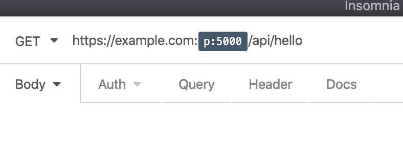

# Insomnia plugin: Default Or
Plugin constains following [Template Tags](https://support.insomnia.rest/article/40-template-tags)

## Installation 

* Preferences > Plugins
* `insomnia-plugin-default-or`

## Port or default (`portOr`)
Uses default port value if not overriden by another (eg. ENV) variable

